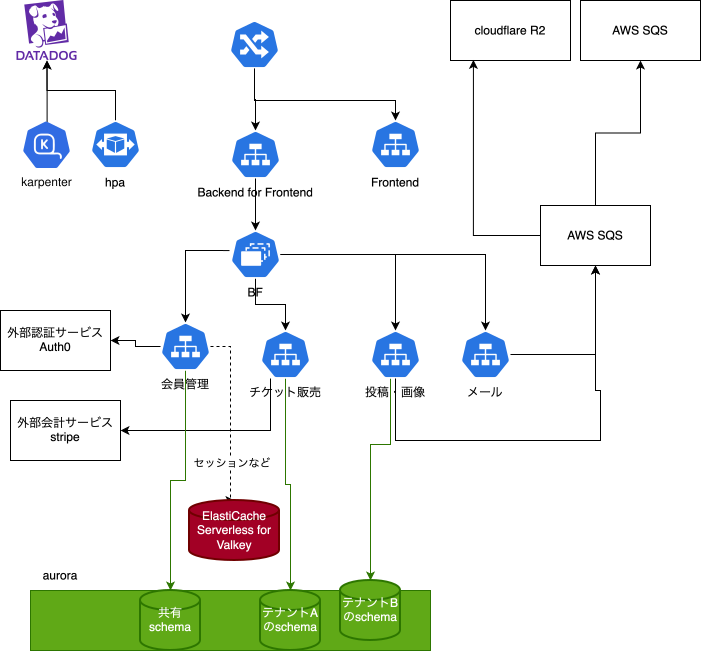

## Architecture Challenge is何
SRE・パブリッククラウド志望学生向けのインターンです。**〜複数のサービスを支えるマルチテナンシーなプラットフォームを設計せよ〜**というサブタイトルの通り、複数のテナントを動かす基盤を設計してみましょうというものです。

>1Dayでほぼ一日中インフラ（クラウド）の設計について考えることができました。脳みそいっぱい使いました!

## 参加者と筆者の技術力と経験
どんな人が参加しているのかな？ついていけるかな...と参加時に不安になったが、話してみたら。以下のどれかの経験を持つ人が多かった印象です（たぶん）
- AWSなどのクラウドをバイトなどで触ったことがある
- 自宅サーバーやっている
- セキュリティの知識がすごい

というように基本的に何かしら経験がある人が多く話を聞いていて面白かった。ちなみ筆者は自宅でk8s運用して成果物動かしているとかECS使ったことがある程度です。AWSの経験や自身でシステムのインフラを設計したことがあるとかなりスムーズに基本的な設計はいけると思います。

## 具体的な課題について
「複数ファンクラブサイトを統合的にホスティングするプラットフォームの設計」という題材でした。以下の点が特にポイントでした
1. チケット購入などの急激なアクセス増加に対応できる
2. 複数のテナントで独立したファンクラブサイトをホスティングできる
3. 少数のプラットフォームメンバーでの開発、コスト最適化

個人的に戸惑った点が`"想定するファンクラブサイトの構成概要については決まっているがどこまでテナントが独立できるようにするか"`がマルチテナントということを考えたことがなかった私にとって難しかった

## 私が作った設計はこうです！

*実際にこれを１日で考える*

*上の図のEKSクラスタ内部やアプリ開発者目線の図*

### 他の人と違う点
**cloudflareを使う**: 自宅サーバーでよく使うためCDNやWAFやWaitingroomがコスパがいいのではと感じ採用した
* prometheus+grafanaでも良いがSaaSを使って他に開発コストをさきたいと感じたため

## 振り返り
- フロントエンドもEKSにおいているためキャッシュが効かない更新された時の場合などは毎回ALB,Natゲートウェイを通すので、それをうまくCloudflare側で配信できたらさらに最適化できたかな
- shecmaでデータさえ分離してあとはpodとインスタンスをうまくスケールしたら低コストで良さそうと思っていたが、namespaceで分離し、他のインフラもテナントごとに分離するというケースを拝見し、巻き添えが起こらなく、費用の計算もできていいのか。と知れた
- 認証周りまで詳しく考えられなかった。奥が深い...